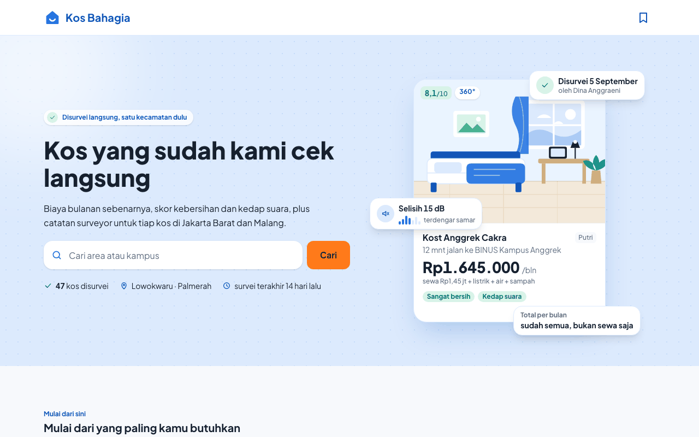
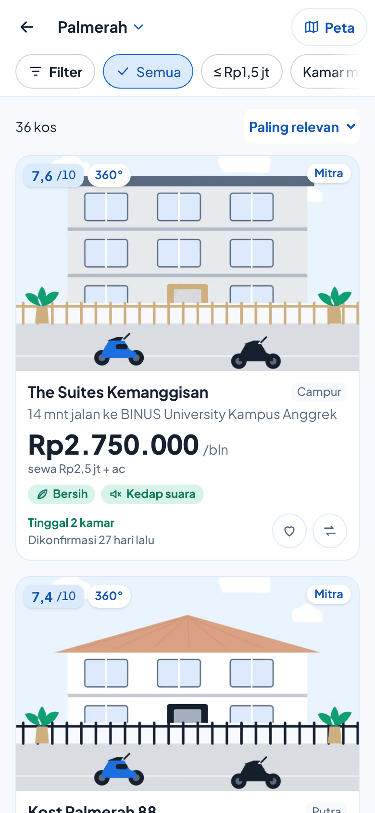
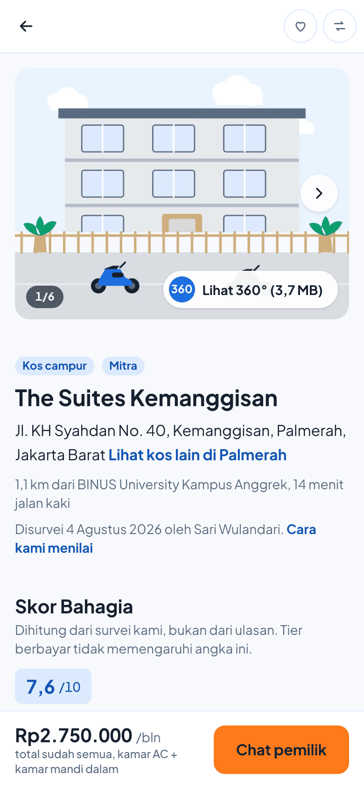

<p align="center">
  
</p>

<h1 align="center">Kos Bahagia</h1>

<p align="center">
  <b>Kos yang sudah kami cek langsung.</b><br>
  Platform pencarian kos untuk Indonesia. Setiap listing didatangi dan dinilai oleh tim surveyor kami
  dengan rubrik yang sama, jadi biaya bulanan yang kamu lihat adalah biaya sebenarnya.
</p>

<p align="center">
  <a href="https://kos-bahagia-umber.vercel.app"><b>Lihat situsnya</b></a> ·
  <a href="https://kos-bahagia-umber.vercel.app/cara-kami-menilai">Cara kami menilai</a> ·
  <a href="https://kos-bahagia-umber.vercel.app/mitra">Halaman mitra</a>
</p>

<p align="center">
  
  
  
  
  
  
</p>

<p align="center">
  
</p>

---

## Kenapa Kos Bahagia

Kami tidak mengejar katalog terbesar. Kami menang di **kepercayaan dan akurasi data**, satu kecamatan
pada satu waktu. Ada tiga hal yang tidak ditampilkan kompetitor mana pun:

| | Yang kami tampilkan | Kenapa penting |
|---|---|---|
| 💸 | **Biaya bulanan sebenarnya**: sewa + listrik + air + sampah + biaya lain sebagai angka utama | Kos "Rp1.200.000" di tempat lain sering kali sebenarnya Rp1.550.000 |
| 🧹 | **Skor kebersihan & kedap suara** dari rubrik tetap, termasuk tes desibel dan pengamatan bahan dinding | Dua hal yang paling sering disesali setelah pindah |
| 📝 | **Catatan surveyor**: tiga hal bagus, tiga hal yang perlu kamu tahu, plus *red flag* keamanan, ditulis oleh manusia bernama | Bukan ulasan bintang yang bisa dipalsukan |

Kami adalah **jembatan, bukan perantara**: tidak ada pembayaran, escrow, atau booking di platform.
Setiap listing berakhir di WhatsApp pemilik. Pendapatan datang dari paket mitra (`free` / `premium` /
`spotlight`), dan **paket berbayar tidak pernah mengubah Skor Bahagia, menyembunyikan red flag, atau
mengubah data survei**. Paket hanya memengaruhi urutan dan kekayaan media.

<table>
  <tr>
    <td align="center"></td>
    <td align="center"></td>
  </tr>
  <tr>
    <td align="center"><sub>Hasil pencarian: harga total di depan, skor, kesegaran data</sub></td>
    <td align="center"><sub>Detail kos: galeri, tur 360°, dan handoff ke WhatsApp</sub></td>
  </tr>
</table>

> Foto di atas masih ilustrasi *seed* (placeholder dari `public/dummy/`). `npm run cek:rilis` memblokir rilis sampai diganti foto asli.

## Skor Bahagia

Skor 0–10 yang **dihitung, tidak pernah diketik tangan**, dari lima komponen:

| Komponen | Bobot |
|---|---:|
| Kebersihan | 30 % |
| Kedap suara | 20 % |
| Transparansi biaya | 20 % |
| Fasilitas dibanding harga | 15 % |
| Lingkungan sekitar | 15 % |

Rumusnya hidup di dua tempat dengan sengaja: [`lib/scoring.ts`](lib/scoring.ts) untuk rincian di UI
(ada unit test), dan view `kos_skor` di Postgres untuk peringkat pencarian. `npm run cek:skor-db`
membuktikan keduanya menghasilkan angka yang sama untuk seluruh seed, termasuk total biaya tiap tipe kamar
(`lib/biaya.ts` vs kolom `total_bulanan`). Kos yang datanya belum lengkap menampilkan "Belum dinilai", bukan
angka tebakan. Transparansi biaya menilai **kelengkapan** informasi biaya (empat cek per tipe kamar), bukan
besarnya biaya tambahan; detailnya di `/cara-kami-menilai` dan [`docs/audit-2026-10.md`](docs/audit-2026-10.md).

## Aturan produk yang dijaga kode

1. **Angka utama adalah total bulanan**, bukan sewa. Sewa tampil kecil di bawahnya beserta rinciannya.
2. **Kesegaran data itu publik.** Setiap listing memperlihatkan kapan ketersediaan terakhir dikonfirmasi.
   Lebih dari 30 hari: turun peringkat dan berlabel "Perlu dikonfirmasi". Lebih dari 90 hari: disembunyikan.
3. **Red flag keamanan selalu tampil** dalam panel merah yang tidak bisa ditutup, apa pun paketnya.
4. **Tanpa tembok login.** Cari, lihat detail, simpan, bandingkan, dan chat pemilik semuanya tanpa akun.
   Autentikasi hanya untuk pemilik kos.
5. **Maksimal empat ketukan** dari beranda ke WhatsApp: preset → kartu → detail → chat.
6. Setiap handoff WhatsApp mencatat baris `klik_wa` lebih dulu. Ini angka yang kami jual ke pemilik.

## Fitur

**Penyewa** (`kosbahagia.com`, `app/(user)/`)

- Beranda dengan preset kebutuhan ("Hemat buat mahasiswa", "Bersih & tenang", "Dekat kampus", ...)
- Pencarian `/cari` dengan filter di URL (bisa dibagikan), peta MapLibre, dan saran area/kampus. Tipe kos bisa dipilih
  lebih dari satu; harga, kamar mandi dalam, dan AC dicocokkan pada tipe kamar yang sama; baris "Filter aktif" bisa dihapus
  satu per satu
- Detail kos: galeri, tur 360° tanpa library, minimap rute SVG, rincian biaya, skor per komponen, catatan surveyor
- Halaman area `/area/[slug]` (SSG, hanya untuk area dengan ≥ 5 listing segar) lengkap dengan fakta, FAQ, dan JSON-LD
- Simpan dan bandingkan hingga 3 kos tanpa login (localStorage), dengan tombol berlabel "Simpan"/"Tersimpan" dan
  "Bandingkan"/"Dalam banding"; perbandingan bisa dibagikan lewat URL
- Menu utama (Cari kos, Simpanan, Bandingkan, Cara menggunakan) dan panduan tiga langkah untuk pengguna baru
- Penjelasan di dekat angka: arti skor, komponen biaya, dan cara jarak dihitung
- `sitemap.xml`, `robots.txt`, OpenGraph, ISR

**Mitra / pemilik** (`mitra.kosbahagia.com`, `app/(mitra)/`)

- Masuk dengan OTP nomor WhatsApp (Supabase phone auth); tidak ada kata sandi
- Dasbor: daftar kos, pembaruan ketersediaan, statistik kunjungan dan klik WhatsApp dibanding median area, halaman paket
- Pengingat Senin via cron: tautan sekali pakai 7 hari (`/t/<token>`) untuk memperbarui ketersediaan langsung dari WhatsApp

## Stack

| Bagian | Pilihan | Alasan |
|---|---|---|
| Framework | Next.js 16 (App Router, Turbopack) + React 19 + TypeScript strict | SSR/SSG untuk SEO; orang mencari kos lewat Google |
| Styling | Tailwind v4 dengan token di `app/globals.css` (`@theme`) | Satu-satunya file yang boleh berisi hex atau px |
| Komponen | Headless UI + komponen sendiri di `components/ui/` | Tanpa kit komponen berat |
| Database | Supabase: Postgres + PostGIS + pg_trgm, RLS di semua tabel, pgTAP | Query radius bawaan |
| Auth | Supabase Auth, **hanya pemilik** | Penyewa tidak pernah diminta login |
| Peta | MapLibre GL + tile OpenFreeMap | Tanpa kunci API, tanpa tagihan per muat |
| Hosting | Vercel (+ cron) | |
| Font | Plus Jakarta Sans lewat `next/font` | Satu keluarga; karakter dari kontras bobot |

Di sisi penyewa, browser hanya memuat klien PostgREST kecil ([`lib/supabase/rest.ts`](lib/supabase/rest.ts)),
bukan `supabase-js`. Hasilnya JS awal `/cari` ≈ 162 KB gzip, `/kos/[slug]` ≈ 169 KB.

## Mulai mengembangkan

Butuh Node 20+, Docker Desktop (untuk Supabase lokal), dan `npm`.

```bash
git clone https://github.com/CalvinWuz/KosBahagia.git
cd KosBahagia
npm install
cp .env.example .env.local
```

Nyalakan database lokal, isi dengan seed, lalu jalankan aplikasinya:

```bash
export SUPABASE_AUTH_SMS_TWILIO_AUTH_TOKEN=lokal-dummy   # dibutuhkan CLI untuk OTP lokal
npx supabase start        # unduh image pertama kali (beberapa GB)
npx supabase db reset     # migrations → seed
npm run dev               # http://localhost:3000
```

Salin `API URL` dan `anon key` dari output `npx supabase status` ke `.env.local`.
Halaman mitra ada di `http://localhost:3000/mitra`; OTP lokal menerima nomor uji
`6281111111111` / `6282222222222` dengan kode `123456`.

### Perintah

| Perintah | Fungsi |
|---|---|
| `npm run dev` | Server pengembangan (menyalin worker MapLibre lebih dulu) |
| `npm run build` | Build produksi; harus lolos tanpa error TypeScript |
| `npm run lint` · `npm run typecheck` · `npm test` | ESLint · `tsc --noEmit` · `node:test` untuk `lib/**/*.test.ts` |
| `npx supabase test db` | 135 asersi pgTAP: `cari_kos_v4`, `kos_promosi_v2`, `cari_kos_v3`, `kos_promosi`, `kos_skor`, `kos_kartu`, RLS, mitra, area, konsistensi data contoh |
| `npm run cek:skor-db` | Bandingkan skor dan total biaya di Postgres dengan `lib/scoring.ts` + `lib/biaya.ts` (butuh Supabase lokal) |
| `npm run db:types` | Regenerasi `lib/supabase/types.ts` (jangan diedit tangan) |
| `npm run seed:generate` | Tulis ulang `supabase/seed/01_seed.sql` dari generator deterministik; memakai `public/dummy/manifest.json` bila ada |
| `node scripts/foto-dummy-ilustrasi.mjs` | Gambar ulang 42 foto placeholder (ilustrasi) ke `public/dummy/` + manifest |
| `node scripts/foto-dummy.mjs` | Versi AI (Gemini) dari skrip di atas; butuh `GEMINI_API_KEY` dengan billing |
| `node scripts/sql-foto-dummy.mjs` | Cetak `UPDATE kos_media` untuk mengarahkan basis data yang sudah terisi ke foto dummy |
| `npm run cek:skor-db` | Bukti `lib/scoring.ts` dan view `kos_skor` sepakat |
| `npm run proses:360 -- foto.jpg --titik kamar --slug <kos>` | Buat file 360° 2048/6144 px dan cetak baris `kos_media` |
| `npm run cek:rilis` | Gerbang rilis terhadap basis data produksi |
| `python3 scripts/uji-ux-v3.py` | 26 skenario browser UX v3 + axe terhadap build lokal (`npm run start -- --port 3011`); butuh Playwright untuk Python |

## Struktur repo

```
app/
  (user)/          beranda, cari, kos/[slug], area/[slug], disimpan, banding, cara-kami-menilai
  (mitra)/mitra/   landing, masuk, daftar, dashboard/*
  api/             sehat (health), galat (laporan error), cron/ingatkan-ketersediaan
  sitemap.ts, robots.ts, global-not-found.tsx
components/
  ui/              Button, Chip, Sheet, Accordion, Skeleton, Badge, Lightbox, FotoBlur, ...
  beranda/ cari/ kos/ area/ layout/
lib/
  scoring.ts       Skor Bahagia (cermin view kos_skor)
  format.ts        rupiah, jarak, waktu relatif (id-ID)
  cari-params.ts   kontrak URL pencarian
  biaya.ts         satu model biaya: total bulanan, estimasi, biaya belum diketahui, uang masuk
  kamar.ts         status per tipe kamar (Tersedia / Penuh / Belum dikonfirmasi), kamar acuan
  simpan.ts        simpan & banding (kos + tipe kamar) di localStorage perangkat ini
  demo.ts          MODE_DEMO: penanda data contoh, tombol WhatsApp tanpa membuka nomor contoh
  supabase/        rest.ts (penyewa), server/mitra (pemilik), types.ts (generated)
  blurhash.ts      decoder BlurHash untuk placeholder foto
supabase/
  migrations/      12 migrasi: enum → tabel → kos_skor + cari_kos → RLS → kos_kartu → area → media → mitra
                   → biaya per tipe kamar + rubrik transparansi → cari_kos_v3 + kos_promosi
                   → cari_kos_v4 + kos_promosi_v2 (tipe kos multi, syarat kamar per tipe kamar)
  seed/            generate.ts → 01_seed.sql (50 kos: 40 Palmerah, 10 Lowokwaru)
  tests/           pgTAP
proxy.ts           routing host mitra, gerbang sesi, noindex
prompts/           prompt tugas 00–09 yang membangun repo ini, dijalankan berurutan
docs/              audit-2026-10.md, hasil-iterasi-v3.md, uji-manusia.md, backlog.md, tangkapan/
CLAUDE.md          konteks proyek permanen (baca ini dulu sebelum mengubah apa pun)
```

<details>
<summary><b>Catatan teknis yang sering dicari</b></summary>

**Peta.** MapLibre ≥ 6 memuat worker sebagai modul terpisah, jadi `scripts/salin-maplibre.mjs`
menyalinnya ke `public/maplibre/` (gitignored) sebelum `dev` dan `build`. Bundle peta dimuat dengan
`next/dynamic` hanya saat peta ditampilkan.

**Minimap** (`components/kos/Minimap.tsx`) adalah SVG murni dari `kos_sekitar.rute`
(format di `prompts/06`, parser di `lib/kos/rute.ts`). Tidak ada ilustrasi per kos.

**Tur 360°** (`components/kos/tur360/`) adalah viewer equirectangular WebGL mentah tanpa library.
Dimuat setelah "Lihat 360°" diketuk: preview 2048 px dulu, lalu file penuh. Tanpa WebGL → foto datar.
Giroskop di balik toggle. File produksi disimpan di Cloudflare R2.

**Halaman area.** Paragraf `area.deskripsi` ditulis tangan per area, tidak pernah dari template.
Fakta dan jawaban FAQ berasal dari fungsi `statistik_area()`. Area di bawah `MIN_LISTING_AREA`
(`lib/area/data.ts`) mengembalikan 404.

**Routing mitra.** `proxy.ts` menulis ulang `/x → /mitra/x` di host mitra, mengalihkan
`/mitra/*` dari host utama, dan memasang `X-Robots-Tag: noindex`. Tanpa subdomain terpisah
(mis. deploy `*.vercel.app`) `/mitra/*` dilayani di host utama.

**Pengingat ketersediaan.** `GET /api/cron/ingatkan-ketersediaan` (jadwal di `vercel.json`,
`Authorization: Bearer $CRON_SECRET`) mencetak tautan kapabilitas 7 hari per kos yang basi dan
mengirimnya lewat WhatsApp (Meta Cloud API jika `WA_CLOUD_*` terisi, dry run jika tidak).
Pembaruan lewat tautan dicatat dengan `sumber = bot_wa`.

**Menautkan kos ke pemilik** setelah survei, dengan service role:
`update kos set owner_id = <auth.users.id> where id = <kos>`.

**Seed deterministik.** `supabase/seed/generate.ts` memakai PRNG mulberry32. Literal pgTAP dipatok ke
stream pertama; kolom yang ditambahkan belakangan memakai stream kedua (`rand2`) dan ketiga (`rand3`, audit
2026-10) supaya tes lama tidak bergeser. Catatan surveyor di seed diturunkan dari data terukur kos yang sama
(setiap calon catatan punya syarat), jadi narasi tidak bisa bertentangan dengan angka.

</details>

## Deploy

Produksi berjalan di Vercel dengan proyek Supabase cloud (Singapura). Migrasi didorong dengan
`npx supabase db push`; migrasi sudah memasang `set search_path = public, extensions` karena Supabase
hosted tidak menyertakan `extensions` saat menjalankan migrasi.

Variabel lingkungan yang dibutuhkan ada di [`.env.example`](.env.example). Ringkasnya:

| Variabel | Untuk |
|---|---|
| `NEXT_PUBLIC_SUPABASE_URL`, `NEXT_PUBLIC_SUPABASE_ANON_KEY` | Akses data penyewa (dilindungi RLS) |
| `SUPABASE_SERVICE_ROLE_KEY` | Server saja: cron dan aksi mitra |
| `NEXT_PUBLIC_SITE_URL`, `NEXT_PUBLIC_MITRA_URL` | Canonical, OpenGraph, tautan footer |
| `CRON_SECRET`, `WA_CLOUD_TOKEN`, `WA_CLOUD_PHONE_ID` | Pengingat Senin |
| `NEXT_PUBLIC_WA_OTP`, `NEXT_PUBLIC_WA_TIM` | Kanal OTP mitra, nomor tim |
| `NEXT_PUBLIC_PLAUSIBLE_DOMAIN`, `ERROR_WEBHOOK_URL` | Analitik tanpa cookie, laporan galat |
| `NEXT_PUBLIC_MODE_DEMO` | Kosong/`1` = prototipe dengan data contoh (banner, label, WhatsApp tidak dibuka). Isi `0` hanya saat datanya asli |

Pemantauan: `GET /api/sehat` mengembalikan `{"ok":true,"db":"ok"}` dan cocok untuk uptime monitor.

**Setelah data atau migrasi berubah:** halaman statis dan cache fetch Next.js bisa menyajikan data lama sampai
waktu revalidasi habis (beranda 10 menit, detail 1 jam), jadi halaman yang berbeda bisa sempat tidak sinkron.
Di lokal hapus `.next/cache/fetch-cache` sebelum `npm run build`; di Vercel lakukan redeploy dan purge Data Cache
(Project Settings → Data Cache).

## Gerbang rilis

Anggaran performa (`/cari`, Fast 3G): LCP ≤ 2,5 s · JS awal ≤ 180 KB gzip · `/kos/[slug]` ≤ 200 KB gzip
di luar viewer 360° · CLS ≤ 0,05 · foto terbesar ke layar 360 px ≤ 120 KB.

Sebelum diumumkan:

1. `npm run cek:rilis` terhadap basis data produksi lolos: ≥ 30 kos tayang bersurveyor, tanpa foto
   placeholder, semua area berdeskripsi.
2. `NEXT_PUBLIC_PLAUSIBLE_DOMAIN` dan `ERROR_WEBHOOK_URL` terisi; `/api/sehat` terdaftar di pemantau uptime.
3. Uji manusia sesuai [`docs/uji-manusia.md`](docs/uji-manusia.md): lima orang, satu tugas, perbaiki tiga hal, ulangi sekali.
4. Fitur baru masuk [`docs/backlog.md`](docs/backlog.md), bukan ke rilis ini.

## Yang sengaja tidak dibangun

Pembayaran dan booking · chat dalam aplikasi · aplikasi native · ulasan bintang dari pengguna ·
rekomendasi AI · scraping listing kompetitor · fitur apa pun yang memaksa login sebelum mencari.

---

<p align="center"><sub>Dibangun oleh <a href="https://github.com/CalvinWuz">Calvin</a> · Copy antarmuka berbahasa Indonesia, komentar kode berbahasa Inggris</sub></p>
