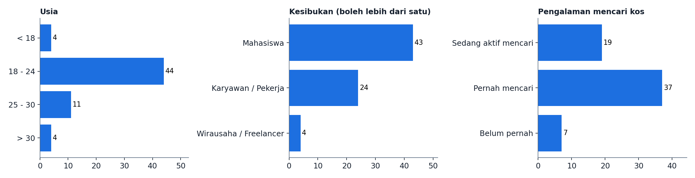
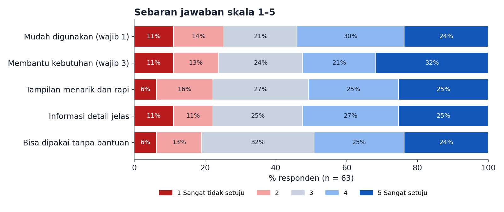
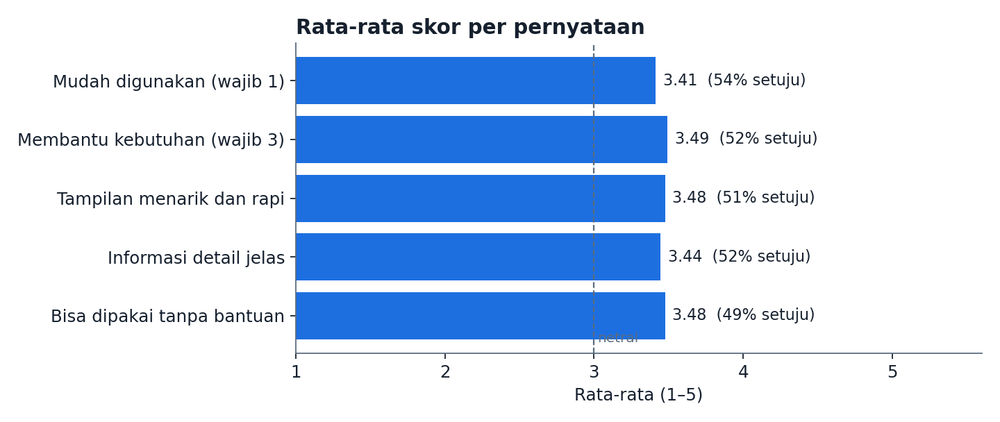
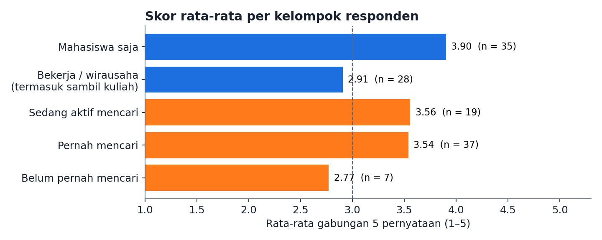
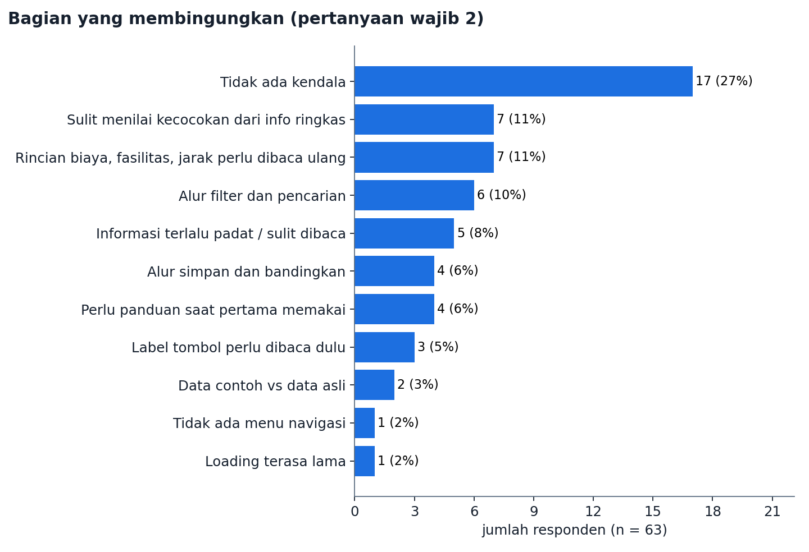
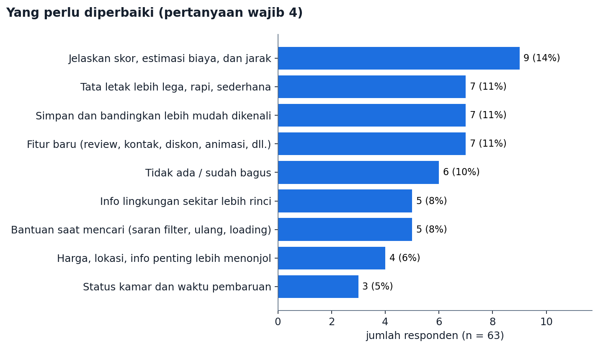
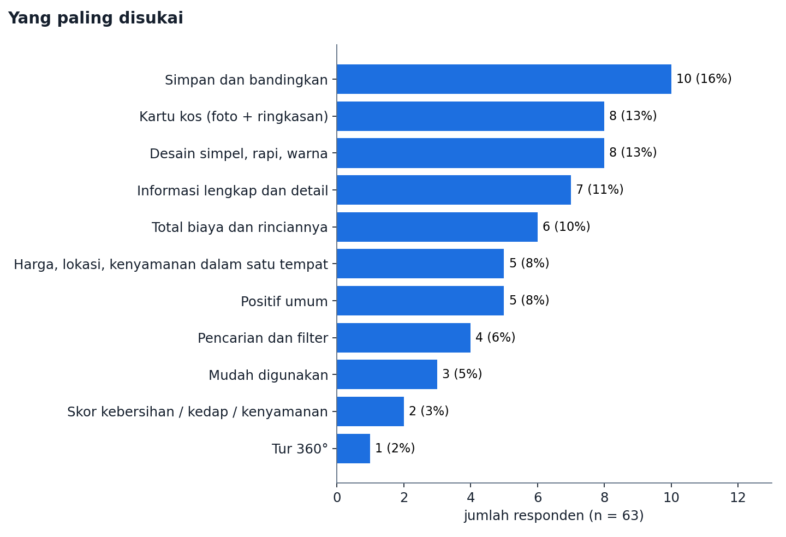

# Prototype Testing Report: Kos Bahagia

**Produk:** Kos Bahagia, website pencarian kos (https://kos-bahagia-umber.vercel.app)
**Versi yang diuji:** versi 2 (rilis 3 Oktober 2026)
**Periode pengisian:** 4–5 Oktober 2026
**Metode:** kuesioner online (Google Form), skala Likert 1–5 dan pertanyaan terbuka
**Jumlah responden:** 63

---

## 1. Ringkasan

- Rata-rata kelima pernyataan berada di **3,41–3,49** dari 5 (gabungan **3,46**). Sekitar **separuh responden setuju**
  dan sekitar **seperlima tidak setuju**.
- **Pertanyaan wajib 1, mudah digunakan:** rata-rata **3,41**, 54% setuju, 25% tidak setuju.
- **Pertanyaan wajib 3, membantu kebutuhan:** rata-rata **3,49**, 52% setuju, 24% tidak setuju.
- **Pertanyaan wajib 2, bagian yang membingungkan:** **63%** responden menyebut setidaknya satu hal yang membuat
  ragu atau bingung. Yang paling sering: sulit menilai kecocokan kos dari informasi ringkas, rincian biaya dan
  fasilitas perlu dibaca ulang, serta alur filter.
- **Pertanyaan wajib 4, yang perlu diperbaiki:** paling banyak meminta **penjelasan skor, estimasi biaya, dan jarak**,
  **tata letak yang lebih lega**, dan **simpan/bandingkan yang lebih mudah dikenali**.
- **Paling disukai:** fitur simpan dan bandingkan, kartu kos berisi foto dan ringkasan, desain yang simpel, serta
  informasi yang lengkap.
- Penilaian **mahasiswa (3,90)** jauh lebih tinggi daripada responden **yang bekerja (2,91)**.

---

## 2. Tujuan pengujian

1. Mengukur apakah website mudah digunakan (pengalaman pengguna).
2. Menemukan bagian yang membuat pengguna bingung (tindakan pengguna).
3. Mengukur apakah produk membantu kebutuhan mencari kos (kegunaan).
4. Mengumpulkan saran perbaikan untuk iterasi berikutnya.

---

## 3. Metode

**Instrumen:** Google Form dengan tiga bagian:
- **Profil:** usia, kesibukan, dan pengalaman mencari kos.
- **Lima pernyataan Likert 1–5** (1 = sangat tidak setuju, 5 = sangat setuju):
  1. Secara keseluruhan, website Kos Bahagia ini sangat mudah untuk digunakan. *(wajib 1)*
  2. Saya merasa website ini sangat membantu kebutuhan saya jika suatu saat harus mencari kos. *(wajib 3)*
  3. Tampilan desain (UI) website ini terlihat menarik, rapi, dan modern.
  4. Informasi detail kos (harga, lokasi, fasilitas) sangat jelas dan mudah dipahami.
  5. Saya merasa nyaman dan bisa menggunakan website ini dengan lancar tanpa bantuan orang lain.
- **Tiga pertanyaan terbuka:** bagian yang membingungkan *(wajib 2)*, hal yang perlu diperbaiki *(wajib 4)*,
  dan satu hal yang paling disukai.

**Analisis:**
- Kuantitatif: rata-rata, median, sebaran jawaban, persentase setuju (4–5) dan tidak setuju (1–2).
- Kualitatif: setiap jawaban terbuka dikelompokkan ke satu tema utama (analisis tematik). Jawaban kosong
  atau "-" dihitung sebagai tidak spesifik.

---

## 4. Profil responden

| Karakteristik | Hasil |
|---|---|
| Usia | 18–24 tahun 44 orang (70%), 25–30 tahun 11 (17%), < 18 tahun 4 (6%), > 30 tahun 4 (6%) |
| Kesibukan *(boleh lebih dari satu)* | Mahasiswa 43, karyawan/pekerja 24, wirausaha/freelancer 4 |
| Pengalaman mencari kos | Pernah 37 (59%), sedang aktif mencari 19 (30%), belum pernah 7 (11%) |

Responden didominasi mahasiswa usia 18–24 tahun yang pernah atau sedang mencari kos, sesuai target pengguna
Kos Bahagia.

---

## 5. Hasil kuantitatif

| Pernyataan | Rata-rata | Median | Setuju (4–5) | Netral (3) | Tidak setuju (1–2) |
|---|---:|---:|---:|---:|---:|
| Mudah digunakan *(wajib 1)* | 3,41 | 4 | 54,0% | 20,6% | 25,4% |
| Membantu kebutuhan *(wajib 3)* | 3,49 | 4 | 52,4% | 23,8% | 23,8% |
| Tampilan menarik dan rapi | 3,48 | 4 | 50,8% | 27,0% | 22,2% |
| Informasi detail jelas | 3,44 | 4 | 52,4% | 25,4% | 22,2% |
| Bisa dipakai tanpa bantuan | 3,48 | 3 | 49,2% | 31,7% | 19,0% |
| **Gabungan** | **3,46** | | | | |

**Temuan:**
- Kelima pernyataan berada sedikit di atas netral (3). Tidak ada aspek yang menonjol jauh lebih baik atau lebih buruk.
- Nilai tertinggi ada pada **membantu kebutuhan** (32% sangat setuju). Konsep produk dinilai berguna.
- **Bisa dipakai tanpa bantuan** punya porsi netral terbesar (32%). Banyak pengguna bisa memakai, tapi belum yakin.

### Perbandingan kelompok

| Kelompok | n | Mudah digunakan | Membantu | Tampilan | Info jelas | Tanpa bantuan |
|---|---:|---:|---:|---:|---:|---:|
| Mahasiswa saja | 35 | 3,86 | 4,00 | 3,91 | 3,91 | 3,83 |
| Bekerja / wirausaha (termasuk sambil kuliah) | 28 | 2,86 | 2,86 | 2,93 | 2,86 | 3,04 |
| Sedang aktif mencari | 19 | 3,58 | 3,47 | 3,58 | 3,53 | 3,63 |
| Pernah mencari | 37 | 3,46 | 3,65 | 3,57 | 3,51 | 3,51 |
| Belum pernah mencari | 7 | 2,71 | 2,71 | 2,71 | 2,86 | 2,86 |

Responden yang bekerja menilai sekitar 1 poin lebih rendah daripada mahasiswa di semua aspek. Jawaban terbuka
mereka banyak meminta kejelasan cara biaya dan skor dihitung, serta informasi sekitar yang lebih rinci. Artinya
mereka butuh lebih banyak dasar sebelum percaya pada angka. Responden yang belum pernah mencari kos (n = 7) juga
menilai lebih rendah, kemungkinan karena belum punya pembanding.

---

## 6. Hasil kualitatif

### 6.1 Bagian yang membingungkan *(pertanyaan wajib 2)*

**40 dari 63 responden (63%)** menyebut setidaknya satu hal yang membuat bingung atau ragu, 17 (27%) tidak
menemui kendala, dan 6 tidak menjawab spesifik.

| Tema | Jumlah | Contoh jawaban |
|---|---:|---|
| Sulit menilai kecocokan dari informasi ringkas | 7 | "Saya masih ragu menentukan kos yang paling cocok hanya dari informasi ringkasnya." |
| Rincian biaya, fasilitas, dan jarak perlu dibaca ulang | 7 | "Aku perlu memastikan fasilitas mana yang ada di kamar dan mana yang dipakai bersama." |
| Alur filter dan pencarian | 6 | Chip "Kamar mandi dalam" ikut memilih "tanpa kamar mandi dalam" di bagian Sembunyikan |
| Informasi terlalu padat atau sulit dibaca | 5 | "Terlalu banyak tulisan"; "UI-nya bikin pusing" |
| Alur simpan dan bandingkan | 4 | "Ngga tau mana yang harus diklik buat masukin ke list buat dibandingin, ternyata pake button yang semacam panah 2" |
| Perlu panduan saat pertama memakai | 4 | "Harus ada tutorial" |
| Label tombol perlu dibaca dulu | 3 | "Aku masih harus membaca labelnya dulu untuk tahu tombol mana yang perlu dipilih." |
| Data contoh vs data asli | 2 | "Saya masih perlu tahu mana informasi contoh dan mana yang nanti diperbarui dari pemilik kos." |
| Tidak ada menu navigasi di header | 1 | "User perlu scroll ke bawah untuk cari fitur apa saja yang ada" |
| Loading terasa lama | 1 | "Loadingnya agak lama" |

### 6.2 Yang perlu diperbaiki *(pertanyaan wajib 4)*

| Tema | Jumlah | Contoh jawaban |
|---|---:|---|
| Jelaskan skor, estimasi biaya, dan jarak | 9 | "Saya ingin penjelasan arti skor kebersihan dan kebisingan, termasuk cara nilainya ditentukan." |
| Tata letak lebih lega, rapi, sederhana | 7 | "Kalo di HP itu jadi penuh banget"; "bagian deskripsi bisa dibagi per bagian" |
| Simpan dan bandingkan lebih mudah dikenali | 7 | "Label tombol sebaiknya menjelaskan apakah hasilnya menyimpan kos atau membuka perbandingan." |
| Fitur baru | 7 | review kos, kontak pemilik, diskon/pembayaran, animasi, filter putra/putri/campur bisa pilih lebih dari satu |
| Info lingkungan sekitar lebih rinci | 5 | "Keterangan seberapa dekat dengan laundry dan toko bahan makanan" |
| Bantuan saat mencari | 5 | saran filter saat hasil kosong, tombol ulang pencarian, penanda saat memuat |
| Harga, lokasi, dan info penting lebih menonjol | 4 | "Saya ingin harga dan lokasi menjadi bagian yang paling cepat terlihat pada setiap kartu." |
| Status kamar dan waktu pembaruan | 3 | "Status kamar dan waktu pembaruan informasi perlu terlihat jelas pada detail kos." |
| Tidak ada / sudah bagus | 6 | "Sudah bagus" |

**Catatan penting:** sebagian permintaan sebenarnya **sudah ada** di website: saran filter saat hasil kosong,
penjelasan skor (tombol "Apa artinya?" dan halaman Cara kami menilai), status kamar beserta tanggal konfirmasi,
dan label estimasi biaya. Masalahnya ada pada **visibilitas**, bukan ketiadaan fitur. Fitur-fitur itu perlu
diletakkan lebih dekat dengan tempat pengguna membutuhkannya.

### 6.3 Yang paling disukai

| Tema | Jumlah |
|---|---:|
| Simpan dan bandingkan | 10 |
| Kartu kos (foto dan ringkasan berdekatan) | 8 |
| Desain simpel, rapi, warna nyaman | 8 |
| Informasi lengkap dan detail | 7 |
| Total biaya dan rinciannya | 6 |
| Harga, lokasi, kenyamanan dalam satu tempat | 5 |
| Pencarian dan filter | 4 |
| Mudah digunakan | 3 |
| Skor kebersihan, kedap suara, kenyamanan | 2 |
| Tur 360° | 1 |

Kutipan: *"Tampilan cukup menarik, informasi yang diberikan juga detail, bahkan ada 360 view, sangat membantu
untuk melengkapi informasi yang tidak ada di platform seperti Mamikos dan Rukita."*

---

## 7. Analisis

1. **Konsep diterima, eksekusi belum.** Fitur yang paling disukai (simpan/bandingkan, total biaya, kartu ringkas)
   adalah nilai inti produk. Banyak responden menulis "saya suka idenya, tapi penggunaannya belum pas".
2. **Masalah utama: kejelasan dan kepercayaan pada angka.** Skor, estimasi biaya, dan jarak perlu dijelaskan di
   tempat angka itu muncul, bukan di halaman terpisah. Ini paling terasa pada responden yang bekerja.
3. **Kepadatan informasi.** Kelengkapan informasi disukai, tapi tampilannya terasa penuh, terutama di HP.
   Informasi perlu diprioritaskan: harga, lokasi, dan status lebih dulu, lalu detail bisa dibuka bila perlu.
4. **Ikon tanpa teks membingungkan.** Tombol banding (ikon panah) dan simpan (ikon hati) tidak langsung dikenali,
   dan jalan menuju daftar simpanan atau perbandingan kurang terlihat.
5. **Ada bug nyata di filter:** chip "Kamar mandi dalam" dan "tanpa kamar mandi dalam" memakai filter yang sama,
   sehingga keduanya terpilih bersamaan.

---

## 8. Rekomendasi (prioritas iterasi berikutnya)

| Prioritas | Rekomendasi | Dasar temuan |
|---|---|---|
| 1 | Tombol simpan dan banding diberi label teks ("Simpan", "Bandingkan"), ditambah tautan Simpanan dan Banding di header | 11 jawaban (kebingungan + perbaikan), fitur paling disukai |
| 2 | Penjelasan singkat langsung di samping skor, estimasi biaya, dan jarak | 9 saran + 7 kebingungan; skor responden bekerja rendah |
| 3 | Rapikan kepadatan: kartu menonjolkan harga, lokasi, status; detail dikelompokkan dan bisa dilipat, terutama di HP | 12 jawaban (padat + tata letak) |
| 4 | Perbaiki filter: pisahkan chip kamar mandi dalam, tipe kos bisa pilih lebih dari satu, tampilkan filter aktif dan tombol ulang | Bug nyata + 6 kebingungan + 5 saran |
| 5 | Panduan singkat untuk pengguna baru (3 langkah) | 4 jawaban, skor "tanpa bantuan" paling banyak netral |
| 6 | Info sekitar lebih rinci (laundry, toko bahan makanan) dan menu navigasi di header | 5 + 1 jawaban |

Permintaan di luar cakupan produk (pembayaran dan diskon, review bintang dari pengguna) dicatat, tapi tidak
diprioritaskan. Kos Bahagia sengaja tidak menangani pembayaran dan memakai catatan surveyor sebagai pengganti
review agar tidak ada ulasan palsu.

---

## 9. Keterbatasan

- Jumlah responden **63**, di bawah target awal 200.
- Responden didominasi mahasiswa usia 18–24 tahun.
- Kuesioner memakai 5 pernyataan Likert sederhana, bukan SUS lengkap, sehingga skor SUS 0–100 tidak dapat dihitung.
- Keberhasilan tiap tugas tidak diukur langsung; penilaian berdasarkan pendapat responden.
- Website memakai data contoh, sehingga penilaian kepercayaan mengukur kesan, bukan akurasi data sungguhan.

---

## Lampiran

- Data mentah: ekspor Google Form (63 baris).
- Grafik: `docs/laporan/grafik/`.
- Pengelompokan tema per responden (indeks baris data, mulai dari 0) ada di skrip pengolahan
  `docs/laporan/olah-data.py`.
